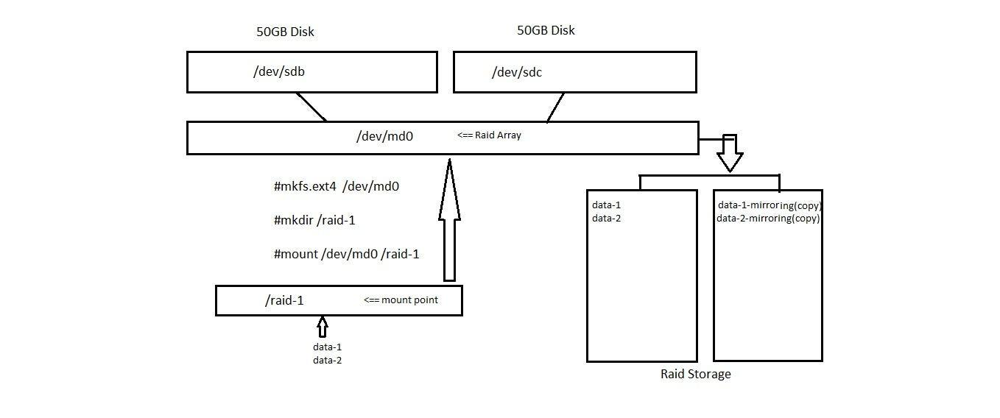

## Linux RAID 1 Setup Using mdadm
**Project Overview* 
This project demonstrates how to create and manage a RAID 1 (Mirroring) array in Linux using mdadm. 

**RAID 1:**
- Mirrors data between two disks
- Provides redundancy
- Protects against single disk failure

**Architecture** 

**Step 1 — Install mdadm**
yum install mdadm -y

**Step 2 — Create RAID 1 Array**
mdadm -C -v /dev/md0 -l 1 -n 2 /dev/sda /dev/sdb
| Option     | Meaning          |
| ---------- | ---------------- |
| `-C`       | Create RAID      |
| `-v`       | Verbose output   |
| `/dev/md0` | RAID device name |
| `-l 1`     | RAID level 1     |
| `-n 2`     | Number of disks  |

**Step 3 — Create Filesystem**
mkfs.ext4 /dev/md0

**Step 4 — Create Mount Point**
mkdir /mnt/raid1

**Step 5 — Mount RAID Array**
mount /dev/md0 /mnt/raid

**Step 6 —Verify RAID Status**
mdadm --detail /dev/md0

**

