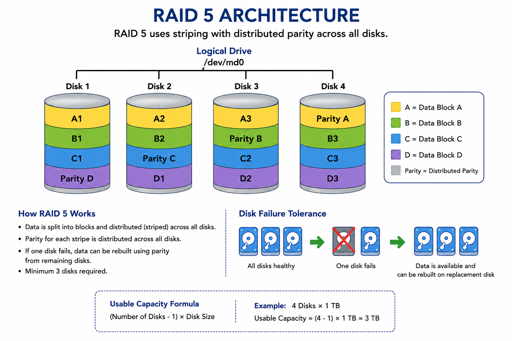

## Linux RAID 5 Setup Using mdadm
**Project Overview* 
This project demonstrates how to create and manage a RAID 5 (Stripping+Parity) array in Linux using mdadm. 

**RAID 5:**
- Minimum 3 disk required
- Provides High performance (Reading and Writing is very fast )
- Protects against single disk failure

**Architecture** 

**Step 1 — Install mdadm** 
yum install mdadm -y

**Step 2 — Create RAID 5 Array** 
mdadm -C -v /dev/md0 -l 5 -n 3 /dev/sda /dev/sdb /dev/sdc
| Option     | Meaning          |
| ---------- | ---------------- |
| `-C`       | Create RAID      |
| `-v`       | Verbose output   |
| `/dev/md0` | RAID device name |
| `-l 5`     | RAID level 5     |
| `-n 3`     | Number of disks  |

**Step 3 — Create Filesystem** 
mkfs.ext4 /dev/md0

**Step 4 — Create Mount Point** 
mkdir /mnt/raid5

**Step 5 — Mount RAID Array** 
mount /dev/md0 /mnt/raid5

**Step 6 —Verify RAID Status** 
mdadm --detail /dev/md0

**